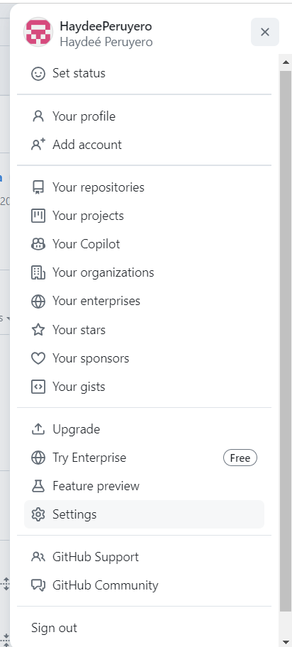
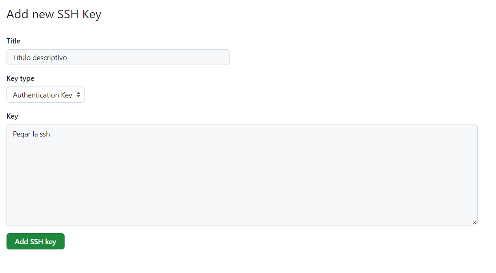

# ¿Cómo conectar GitHub con RStudio?


Generalmente cuando comenzamos un proyecto, el primer borrador no es el final y queremos una forma de poder llevar un registro de los cambios sobre el tiempo. Cuando colaboramos con otras personas, una forma de compartir el trabajo y hacer ediciones es enviarnos los archivos por email o manternerlos en alguna carpeta que todos tengamos acceso, sin embargo, si a alguien se le olvida avisarnos que hizo cambios o no actualiza los archivos vamos a estar trabajando sobre archivos diferentes y probablemente tengamos perdida de información o que lo que alguien realizo no nos coincide a nosotros.

Git es un sistema de control de versiones creado para desarrolladores para colaborar en grandes proyectos. Git nos ayuda a llevar un registro de los cambios que se han realizado y quien ha realizado los cambios, además guarda las versiones anteriores y en caso de algún conflicto con versiones recientes siempre es posible regresar a alguna versión previa donde todo funcionaba correctamente. Cada proyecto se guarda en un repositorio que incluye todos los archivos que forman parte del proyecto, esto puede ser bases de datos, reportes, imágenes, scripts, etc.

Git se puede usar localmente pero si se requiere compartir todo con colaboradores, entonces se debe almacenar en la web para que otros lo puedan descargar. Los repositorios pueden ser públicos o privados. GitHub se ha convertido en uno de los mayores hospederos de repositorios de Git que además incluye algunas otras características útiles.

Lo primero que necesitamos es tener instalado Git.

## Instalar Git

Instalar [Git for Windows](https://gitforwindows.org/):

  - Configurar su PATH: seleccionar `Git from the command line and also from 3rd-party software`.
  - RStudio prefiere que Git esté instalado en `C:/Program Files` que suele ser el de default.

## Configurar Git

Existen dos formas de realizar una conexión con GitHub desde RStudio, depende del tipo de protocolo de seguridad que uno seleccione:

- HTTPS

- SSH


### Conexión mediante SSH

Primero, vamos a revisar si ya tenemos algunas llaves ssh, en una terminal de Git colocamos lo siguiente:

```bash
ls -al ~/.ssh
```

Dependiendo de si ya hemos generado llaves ssh, podemos ver algo similar a lo siguiente o algo vacío:

```output
total 28
drwx------  2 haydee rstudio-users 4096 May 27 10:39 .
drwxr-x--- 17 haydee rstudio-users 4096 May 22 16:20 ..
-rw-------  1 haydee rstudio-users  750 Apr 12 17:07 authorized_keys
-rw-------  1 haydee rstudio-users  419 May 27 10:39 id_ed25519
-rw-r--r--  1 haydee rstudio-users  106 May 27 10:39 id_ed25519.pub
-rw-------  1 haydee rstudio-users 1956 Apr 13 19:50 known_hosts
-rw-------  1 haydee rstudio-users 1120 Apr 13 19:50 known_hosts.old
```

En RStudio, vamos a abrir una terminal y colocar:

```r
ssh-keygen -t ed25519 -C "email@dominio"
```

Nos va a salir el siguiente mensaje:

```output
Generating public/private ed25519 key pair.
Enter file in which to save the key (/home/user/.ssh/id_ed25519):
```

Vamos a dar enter y no vamos a cambiar el nombre del archivo. Inmediatamente nos preguntará por una contraseña (si colocamos contraseña solo deben recordarla porque será la forma en la que nos permitirá clonar el repositorio y realizar cambios.)

```output
Generating public/private ed25519 key pair.
Enter file in which to save the key (/home/user/.ssh/id_ed25519):
```

Una vez realizado esto, nos desplegará un mensaje similar al siguiente:

```output
Your identification has been saved in /home/user/.ssh/id_ed25519
Your public key has been saved in /home/user/.ssh/id_ed25519.pub
The key fingerprint is:
SHA256:deHzMDxkasldadAySuvcDQasnflaskfLw8ca7CNbxMjkTxU email@dominio
The key's randomart image is:
+--[ED25519 256]--+
|          . . A. |
|         = B - + |
|        o * ^ k o|
|         B X # * |
|        S T B o .|
|       . . = o . |
|      . o M   .  |
|       o 5       |
|        ...      |
+----[SHA256]-----+
```

Volvemos a colocar en la terminal lo siguiente para verificar que en efecto ya se creo nuestras llaves:

```bash
ls -al ~/.ssh
```

Vamos a copiar la llave, una forma de hacerla es como sigue:

```bash
cat ~/.ssh/id_ed25519.pub
```

En pantalla veremos algo como lo que sigue:

```output
ssh-ed25519 BBBdasdasdAC3AAILAFi66Apzasfadgjncajae72ende983nfcasdx7TLY9 email@dominimo
```
Copiamos eso al clipboard o algún archivo de texto para no perderlo, ya que lo usaremos en un momento para terminar la configuración con GitHub.

Ahora, debemos pasarle a GitHub nuestra llave para establecer la conexión.

Vamos a ir nuestra cuenta de GitHub y dar click en **settings**



Después, nos vamos a donde dice **SSH and GPG keys**.


Damos click en el botón que dice **New SSH key**.


Vamos a colocar un título descriptivo que nos indique para que estamos usando esa llave y pegamos la llave:




### Conexión con HTTPS


Primero debemos asegurarnos que tenemos instalados los paquetes adecuados:

```r
install.packages(c("usethis", "gitcreds", "gh"))
```

Ahora debemos identificarnos con nuestras credenciales de GitHub.

```r
usethis::use_git_config(user.name = "Usuario GitHub", user.email = "email de la cuenta de GitHub")
```

Para poder subir los cambios a GitHub, necesitamos autenticarnos, es decir, probar que somos los dueños de la cuenta de GitHub. 

Con este método, se pueden clonar los repositorios usando el url que sale en HTTPS. Para este, necesitamos un __personal access token__ (PATH). 

Para obtener el PATH, vamos a correr lo siguiente en la consola de R:

```r
usethis::create_github_token(
  scopes = c("repo", "user", "gist", "workflow"),
  description = "alguna descripcion",
  host = "https://github.com/"
)
```

Esta función nos abrirá un navegador para generar el PATH:

  - Dar una descripción al PATH: por ejemplo "Laptop personal/Computadora laboratorio".
  - Cambiar la fecha de vencimiento: la fecha puede ser por cierta cantidad de días o sin fecha de vencimiento.
  - Dejar las demás opciones default y seleccionar `Generar token`. Este token deben de **guardarlo** en algún lugar ya que no es posible verlo de nuevo una vez que cierren la página. 
  
Si olvidan su PATH es posible generar otro.

Para guardar el PATH, ejecuten el siguiente código en la consola de RStudio:

```r
gitcreds::gitcreds_set(url="http://github.user")
```

Cuando se habrá la ventana les pedirá pegar su PATH en la consola y presionar enter. De está forma las credenciales ya quedarán guardadas en su computadora.

Para confirmar que su PATH si se guardo correctamente, correremos el siguiente código:
```r
gh::gh_whoami(.token = "ghnaojdnvoadenvas_dcasc86<", .api_url = "https://github.com")


usethis::git_sitrep()
```

Lo que deberán ver son sus datos de su cuenta de GitHub.


