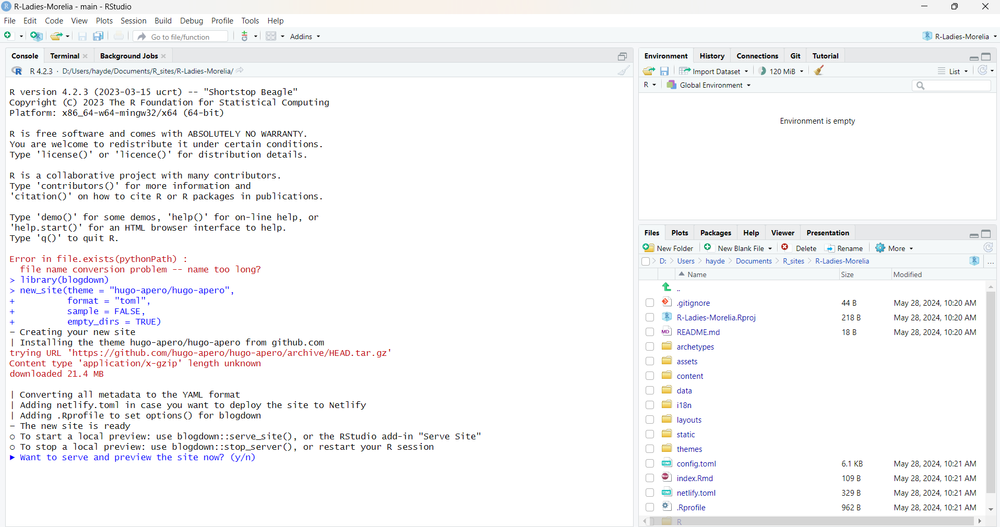
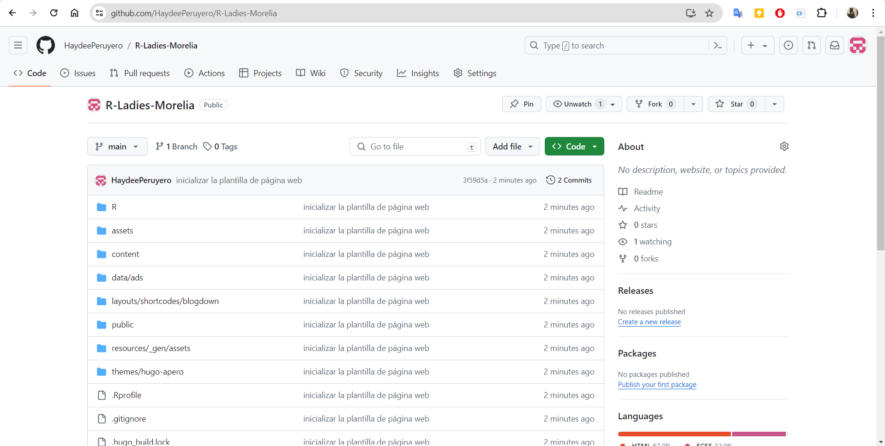
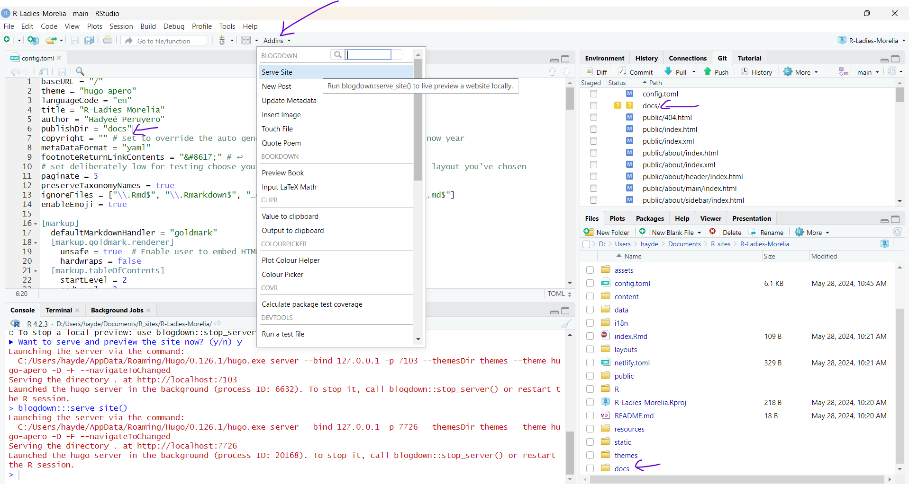
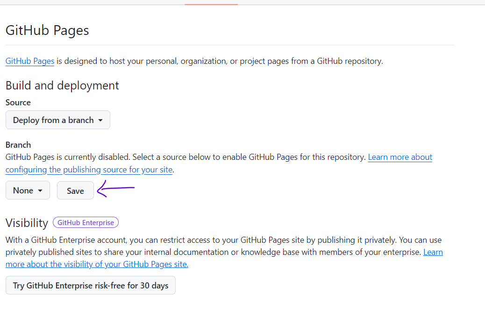
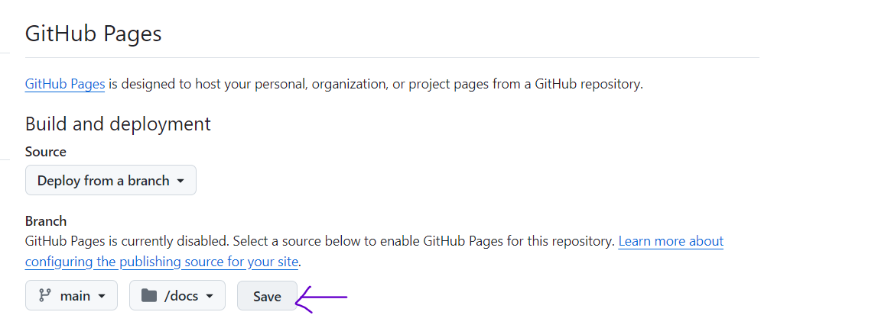
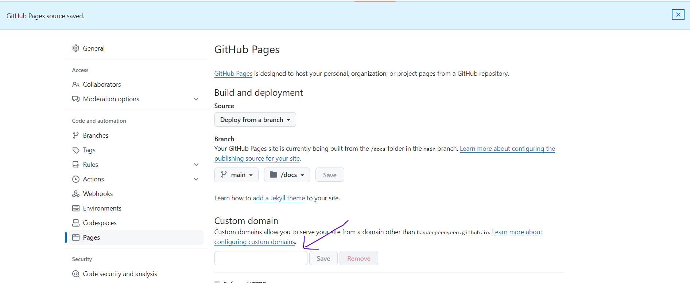

### “En este tutorial aprenderemos a crear un sitio web personal/blog”


# 1. Set up

Antes comenzar es importante tener las versiones más recientes de R y RStudio:

- R v>=3.6.0

- RStudio >= 1.4

**Nota:** Necesitamos también tener una conexión de GitHub con RStudio, en el siguiente link está un tutorial de como realizarlo. 

[¿Cómo conectar GitHub con RStudio?](https://r-ladies-morelia.github.io/blog/github/)


Por último necesitamos instalar lo siguiente:

- Instalar `blogdown`: `install.packages("blogdown")`

- Instalar Hugo: `blogdown::install_hugo()`, verificar que la versión sea una actual con `blogdown::hugo_version()`.

Y necesitamos saber un poquito de Markdown.


# 2. Crear tu sitio

## Crear un repo en GitHub

Lo primero que debemos hacer es crear un repositorio en github que alojará nuestra página web.

Si nuestra página web se llamará "RLadiesMorelia", nuestro repositorio se debe llamar "RLadiesMorelia.github.io" ya que ese será el dominio de nuestro sitio web.




Crea un nuevo repositorio en github  <https://github.com/new>:

+ Inicializalo con un `README` 

+ No añadir un `.gitignore`- este se añadirá más tarde. 











Clonar el repositorio usando lo siguiente:

+ Dar click en el botón verde de <i class="fas fa-download fa-fw"></i>**Code**.

+ Seleccionar ya sea HTTPS o SSH según como sea su conección con RStudio y copiar el link.









## Crear un proyecto en RStudio


Debemos crear un proyecto en RStudio para poder hacer la conexión con GitHub. 
En primer lugar clonaremos el repositorio para trabajar de manera local.

  1. Abrir RStudio.
  2. Luego, en el menú `File` hacer click en `New Project`.
  3. En la ventana que se abre, hacer click en `Version Control`.
    
  4. Después hacemos click en `Git`.
    
  5. Pegar la url que se copio de HTTPS o SSH en la ventana de RStudio. Cambiar el nombre del directorio (si así lo deseamos), elegir la carpeta donde se va a guardar el clón del repositorio. Marcar `Open in new session` para que el proyecto utilice su propia sesión de `R`.
    
    Y presionar en `Create Project` para que se cree el nuevo proyecto.


Una vez realizado lo anterior ya se puede trabajar dentro del proyecto.

    
## Crear el sitio web

Vamos a usar blogdown para crear un sitio web con el tema de Hugo Apéro. En la consola de RStudio realizamos lo siguiente:


```r
> library(blogdown)
> new_site(theme = "hugo-apero/hugo-apero", 
           format = "toml",
           sample = FALSE,
           empty_dirs = TRUE)
```

Nos saldrá un mensaje que pregunta si queremos visualizar el ejemplo del sitio, colocar `y`.


```r
― Creating your new site
| Installing the theme hugo-apero/hugo-apero from github.com
trying URL 'https://github.com/hugo-apero/hugo-apero/archive/HEAD.tar.gz'
downloaded 21.4 MB

| Converting all metadata to the YAML format
| Adding netlify.toml in case you want to deploy the site to Netlify
| Adding .Rprofile to set options() for blogdown
― The new site is ready
○ To start a local preview: use blogdown::serve_site(), or the RStudio add-in "Serve Site"
○ To stop a local preview: use blogdown::stop_server(), or restart your R session
► Want to serve and preview the site now? (y/n) 
```





Nos preguntará si queremos tener un preview del sitio web:

```r
► Want to serve and preview the site now? (y/n)
```

Seleccionamos `y` y dejamos que blogdown cree el sitio. Esto nos abrirá en el panel inferior derecho la pestaña Viewer. Si damos click en el icon  <i class="fas fa-external-link-alt"></i> *Show in new window* (a la derecha del símbolo :broom:) podemos previsualizarlo en un navegador!! 


Ahora, debemos configurarlo, pero antes, vamos a enviar este sitio de prueba a nuestro GitHub para tener el respaldo del sitio inicial y si algo sale mal en la configuración no tener que repetir todo. 

Vamos a ir a la terminal de nuevo y colocamos lo siguiente:

```bash
git add.
```

Esto lo que hará es añadir todo lo que hemos realizado al `área de preparación`. Ahora, realizaremos nuestro primer commit.

```bash
git commit -m "inicializar la plantilla de página web"
```

Resta solo hacer un push a nuestro GitHub:

```bash
git push
```


Si vamos ahora a nuestro repo de GitHub, veremos todos los archivos que se crearon con esta plantilla.




### Actualizar el tema

NOTA: USAR CON PRECAUCIÓN LO SIGUIENTE.

Para actualizar un tema dentro del mismo sitio usamos lo siguiente, cambiando el tema por alguno de los disponibles:

- [TEMAS DISPONIBLES](https://themes.gohugo.io/)

Cambiar en el siguiente código `hugo-apero/hugo-apero` por el tema a actualizar.

```r
blogdown::install_theme(theme = "hugo-apero/hugo-apero",
                        update_config = FALSE, 
                        force = TRUE)
```

### Convertir/Cambiar tema de un sitio existente 

NOTA: USAR CON PRECAUCIÓN LO SIGUIENTE.

Una vez creado un sitio web podemos cambiar el tema, en el siguiente link se encuentran los pasos a seguir.

[link](https://silviacanelon.com/blog/2021-06-01-hello-hugo-apero/)


# 3. Configurar tu sitio


Ahora, vamos a comenzar la configuración del sitio.

En el panel inferior derecho, en files vamos a encontrar todos los archivos que trae de prueba el tema de Hugo-Apero. Vamos a comenzar con el archivo que se llama config.toml que es donde se encuentran todas las variables inciales.


## Variables de Hugo

La lista completa de variables de Hugo esta en [Hugo docs](https://gohugo.io/getting-started/configuration/#all-configuration-settings). 

Las primeras que editaremos son las de título y autor.

```toml
baseURL = "/"
theme = "hugo-apero"
languageCode = "en"
title = "R-Ladies Morelia"
author = "Hadyeé Peruyero"
```

Vamos a añadir una opción más después de autor, para indicar donde se guardará todos los docs que se crearán ya que esto es lo que usaremos para hospedar el sitio web en GitHub.


```toml
publishDir = "docs"
```

Damos click en guardar y después en la parte superior aparece un botón que dice `Addins`, damos click en `serve_site` y vamos a observar que se crea una carpeta `docs` en los archivos.



Hasta el momento tenemos solo una previsualización de nuestro sitio. Vamos a "construirlo" y enviar eso a GitHub. Vamos escribir en la consola lo siguiente:

```bash
blogdown::build_site()
```


## Hospedar sitio en GitHub

Ya que tenemos construido el sitio, vamos a de nuevo realizar un commit y enviar todo a GitHub para comenzar configurar el sitio en GitHub y que ya esté "vivo".

```bash
git add .
git commit -m "Actualización de carpeta docs"
git push
```

En GitHub, nos vamos a ir a "settings".


Después, vamos a "Pages".


Buscamos la sección de "Build and deployment" y "Branch"



Y en la parte de "Branch" realizamos la configuración de `main-docs`:



Después de unos minutos, si actualizamos la página, veremos el nuevo dominio donde quedará hospedada la página web.


Existe una forma de configurar el dominio de nuestra página, en esa sección de GitHub trae un link a la documentación de como configurar el dominio.



Una alternativa a esto, es crear una "Organización" con algún título que queramos que sea nuestro dominio y ahí generar nuestra página web con el nombre de la organización, por ejemplo, crear una organización llamada RLadiesMorelia y un repositorio llamado RLadiesMorelia.github.io.

Si ya creamos nuestro sitio y estamos teniendo problemas con la visualización debido al nombre de nuestra cuenta y del repositorio, se puede realizar esto último de crear una Organización y transferir el repositorio que estamos configurando. Una vez hecho esto, solo debemos actualizar en nuestro proyecto local el `origin` del repositorio para seguir haciendo cambios desde el local y no tener que volver a clonarlo.

```bash
git remote -v

git remote set-url origin git@github.com:name/name.github.io.git
```

Esto de aquí `git@github.com:name/name.github.io.git` es el link que nos proporciona el tipo de conexión que realizamos al repositorio, ya sea en el boton de HTTPS o SSH.


## Apéro variables

Existen varias variables de Apéro globales que podemos modificar. Todas se encuentran después de la sección `[params]` en el archivo `config.toml`. Las más importantes son:

```toml
[params]
  orgName = "RStudio"
  orgLocal = "Anywhere"
  description = "A modern, beautiful, and easily configurable blog theme for Hugo."
  favicon = "/img/favicon.ico"
  logo = "/img/blogophonic-mark-dark.png"
  mainSections = ["blog", "project", "talk"]
  navallcaps = true
  # Default image for social sharing and search engines. 
  # Place image file in `static` folder and specify image name here.
  sharing_image = "/img/papillons.jpg"
  # Twitter username (without @). Used when a visitor shares your site on Twitter.
  twitter = "apreshill"
```

Todas las imágenes las deberíamos poner en un folder llamado `/static/img/` (`favicon`, `logo`, y `sharing_image`) en la raíz del proyecto.

```bash
config.toml
static/
└── img/
    ├── favicon.ico 
    ├── blogophonic-mark-dark.png
    └── papillons.jpg
```

Vamos a actualizar algunas de las imágenes para ir viendo como configurarlo:

- papillons.jpg
- revoir.png
- favicon.ico
- blogophonic-mark-dark.png
- avatar.png

Subamos algunas imágenes con esos nombres a la carpeta `static` y la imágen avatar.png a la carpeta `about/sidebar`.

Una vez actualizadas esas imágenes, vamos a modificar el archivo de configuración:

```toml
[params]
  orgName = "RLadiesMorelia"
  orgLocal = "Haydeé Peruyero"
  description = "Una página de prueba de RLadies Morelia"
  favicon = "/img/favicon.ico"
  logo = "/img/logo-rladies.jpeg"
  mainSections = ["blog", "project", "talk"]
  navallcaps = true
  # Default image for social sharing and search engines. 
  # Place image file in `static` folder and specify image name here.
  sharing_image = "/img/papillons.jpg"
  # Twitter username (without @). Used when a visitor shares your site on Twitter.
  twitter = "rladiesmorelia"
```

Vamos a darle guardar, y vamos a abrir ahora el archivo `_index.md` que se encuentra dentro de la carpeta `content`. En ese archivo, vamos a realizar unas modificaciones:

```md
title: "RLadies Morelia"
subtitle: "Una página de prueba para el tutorial de RLadies Morelia"
description: "Esta página será una prueba adicional a la página de RLadies Morelia"
images:
  - img/logo-rladies.jpeg
image_left: true
text_align_left: false
show_social_links: true # specify social accounts in site config
show_action_link: true
action_link: /about
action_label: "Read More &rarr;"
action_type: text # text, button
type: home
```

Guardamos ambos archivos y vamos al menú de `Viewer` para visualizar estos cambios.


## Color del tema

Existen tres formas de cambiar el tema

+ Usar un [color de tema](/learn/color-themes/#use-a-color-theme),
+ Usar [Tachyons colors](/learn/color-themes/#use-tachyons-named-colors), o
+ Personalizar con [hex codes](/learn/color-themes/#bring-your-own-hex-codes).

De nuevo, en el archivo `config.toml`, vamos a buscar la siguiente sección que es donde podemos modificar colores.

```toml
[params]
  # use a built-in color theme
  # one of: forest / grayscale / peach / plum /
  #         poppy / sky / violet / water
  theme = "peach"
  
  # or, leave theme empty & make your own palette
  # see docs at https://hugo-apero.netlify.app/learn/color-themes/
  # the custom scss file must be in the assets/ folder
  # add the filename name here, without extension
  # to use hex colors instead of named tachyons colors, include "hex" in filename
  custom_theme = "" 
```

Cambiemos el `theme` y demos guardar, vamos a observar en `Viewer` estos cambios de inmediato. 

### Colores personalizables

Vamos a ir a la carpeta `assets` que se encuentra en la raíz, dentro de esa carpeta están unos archivos `named-color.scss` y `hex-colors.scss`. Vamos a abrir el segundo:

```scss
// set custom hex colors 
$siteBgColorCustom: #8F7ED4;
$sidebarBgColorCustom: #5B2AB6;
$textColorCustom: #5B2AB6;
$sidebarTextColorCustom: #666260;
$headlineColorCustom: #5B2AB6;
$headingColorCustom: #5B2AB6;
$bodyLinkColorCustom: #5B2AB6;
$navLinkColorCustom: #5B2AB6;
$sidebarLinkColorCustom: #FA6F35;
$footerTextColorCustom: #F9A51E;
$buttonTextColorCustom: #f7f7f4;
$buttonHoverTextColorCustom: #f9f9f8;
$buttonBgColorCustom: #5B2AB6;
$buttonHoverBgColorCustom: #FA6F35;
$borderColorCustom: #F9A51E;
```

Esa es la lista de colores que necesitaríamos configurar si quisieramos crear un tema nuevo. Esa lista es un ejemplo con algunos de los colores de RLadies Morelia. Si por ejemplo modificamos esos colores, la forma de visualizar esos cambios sería cambiar en el archivo `config.toml` lo siguiente:

```toml
[params]
  # use a built-in color theme
  # one of: forest / grayscale / peach / plum /
  #         poppy / sky / violet / water
  theme = ""
  
  # or, leave theme empty & make your own palette
  # see docs at https://hugo-apero.netlify.app/learn/color-themes/
  # the custom scss file must be in the assets/ folder
  # add the filename name here, without extension
  # to use hex colors instead of named tachyons colors, include "hex" in filename
  custom_theme = "hex-colors" 
```

Con el otro archivo de `named-colors.scss` es similar. 

La documentación completa de como realizar estos cambios está en el [link](https://hugo-apero.netlify.app/blog/color-themes/).


## Social icons

En el archivo `config.toml` se encuentra una sección para configurar los icons a sus redes sociales:

**NOTA:** Probablemente necesiten instalar `fontawesome, icons, academicons`.

```toml
[params]
  # show/hide social icons in site header & footer
  socialInHeader = false
  socialInFooter = false
  
  [[params.social]]
      icon      = "github" # icon name without the 'fa-'
      icon_pack = "fab"
      url       = "https://github.com/orgs/R-Ladies-Morelia/repositories"
  [[params.social]] <!--lather, rinse, repeat-->
```

La documentación completa para esto se encuentra en el link [Documentación](https://hugo-apero.netlify.app/blog/social/).


## Menus

Tal vez, la parte más importante serán nuestras secciones. Estás también aparecen el archivo `config.toml`, cada sección que coloquemos debe tener una carpeta dentro de la carpeta `content`. Y cada carpeta de sección debe contener un archivo `_index.md` que será la configuración inicial de dicha sección.

```toml
[menu]
  [[menu.header]]
    name = "About"
    title = "About"
    url = "/about/"
    weight = 1
  [[menu.header]] <!--lather, rinse, repeat-->
```
Vamos a desglozar ese código:

- `name`: es el nombre de la sección principal.

- `title`: es algún título para dicha sección, el cual no será visible pero es usado para accesibilidad, saldrá un mensaje emergente cuando pasemos el mouse por ahí.

- `url`: es el link a la carpeta, aquí debe ir el nombre de la carpeta que contendrá esa sección.

- `weight`: El orden de la sección, en este caso 1 indica que es la primera sección.

Y vamos a repetir ese código tantas veces como sea necesario, es decir, tantas veces como secciones tengamos en nuestra página.

Una vez realizado esto, vamos a ir de nuevo a donde configuramos los primeros parámetros de Apero, para cambiar las secciones principales.

```toml
[params]
  orgName = "RLadiesMorelia"
  orgLocal = "Haydeé Peruyero"
  description = "Una página de prueba de RLadies Morelia"
  favicon = "/img/favicon.ico"
  logo = "/img/logo-rladies.jpeg"
  mainSections = [`"about", "blog", "project", "talk", "other"]
  navallcaps = true
  # Default image for social sharing and search engines. 
  # Place image file in `static` folder and specify image name here.
  sharing_image = "/img/papillons.jpg"
  # Twitter username (without @). Used when a visitor shares your site on Twitter.
  twitter = "rladiesmorelia"
```

También podemos configurar los pies de página en: 

```toml
  [[menu.footer]]
    name = "License"
    title = "License"
    url = "/license/"
    weight = 1
  [[menu.footer]] <!--lather, rinse, repeat-->
```


## Tipos de letra

Existen también tres formas de configurar esto:

+ Usar [embedded fonts](/learn/fonts/#embedded-fonts),
+ Usar [system fonts](/learn/fonts/#use-attractive-system-fonts), o
+ Usar [custom fonts](/learn/fonts/#use-a-custom-font).

Se encuentra en el archivo `config.toml`:

```toml  
[params]
  # use an embedded font
  customtextFontFamily = "Commissioner"
  customheadingFontFamily = "Fraunces"
  
  # or choose a system font stack
  textFontFamily = "sans-serif"
  headingFontFamily = "serif"
```

[Documentacón completa](/learn/fonts/).


Vamos a enviar todos estos cambios a GitHub para no arriesgarnos a que falle algo y poder recuperar alguna versión anterior.

```bash
git add .
git commit -m "Configuración de secciones y tema-colores"
git push
```

# 4. Configurar secciones

**Nota:** Dentro de cada carpeta principal, se encuentra una imagen, si queremos reemplazarla, la imagen que subamos se debe llamar de esa forma, de lo contrario no lo reconocerá. Por ejemplo, en la carpeta `projects` hay varias subcarpetas, una por cada proyecto que vemos ahorita. Dentro de cada una de ellas existe una imagen que se llama featured. Si queremos reemplazar esa imagen, debemos subir una con ese mismo nombre.

## Sección Blog

Vamos a comenzar con alguna carpeta, digamos la que se llama `blog`. Vamos abrir (o crear) el archivo `_index.md` donde se encuentra la configuración inicial de cada sección principal.

Cada sección del archivo define diferentes aspectos de la configuración del blog, incluyendo metadatos, opciones de diseño y contenido de la barra lateral.

Vamos a desglosar cada parte:

### Encabezado y Metadatos del Blog

```yaml
title: R-Ladies Blog
description: |
  Aquí encontrarás....
author: "Alguien de @rladies_morelia"
show_post_thumbnail: true
thumbnail_left: true # for list-sidebar only
show_author_byline: true
show_post_date: true
show_button_links: false
# for listing page layout
layout: list-sidebar # list, list-sidebar, list-grid
```

- `title`: Título del blog.
- `description`: Descripción del blog, usando el símbolo `|` para permitir múltiples líneas.
- `author`: Autor del blog.
- `show_post_thumbnail`: Muestra la miniatura del post.
- `thumbnail_left`: Indica si la miniatura debe aparecer a la izquierda en el diseño `list-sidebar`.
- `show_author_byline`: Muestra el nombre del autor en los posts.
- `show_post_date`: Muestra la fecha de publicación en los posts.
- `show_button_links`: Controla si se muestran los enlaces de botones.
- `layout`: Define el diseño de la página de listado de posts. Las opciones pueden ser `list`, `list-sidebar`, `list-grid`.

### Configuración de la Barra Lateral (Sidebar)

```yaml
# for list-sidebar layout
sidebar: 
  title: Cosas interesantes
  description: |
    Aquí.....
    
    Check out the _index.md file in the /blog folder 
    to edit this content. 
  author: "Alguien de @rladies_morelia"
  text_link_label: Subscribete en Meetup
  text_link_url: /index.xml
  categories_link: true
  series_link: true
  tags_link: true
  show_sidebar_adunit: true # show ad container
```

- `title`: Título de la barra lateral.
- `description`: Descripción de la barra lateral, usando `|` para múltiples líneas.
- `author`: Autor de la barra lateral (puede ser el mismo o diferente del autor principal).
- `text_link_label`: Etiqueta del enlace de texto en la barra lateral (por ejemplo, "Subscribe via RSS").
- `text_link_url`: URL del enlace de texto.
- `categories_link`: Muestra un enlace a las categorías.
- `series_link`: Muestra un enlace a las series.
- `tags_link`: Muestra un enlace a las etiquetas.
- `show_sidebar_adunit`: Indica si se debe mostrar un contenedor de anuncios en la barra lateral.

### Configuración Común para Todas las Páginas dentro de la Carpeta `blog/`

```yaml
# set up common front matter for all pages inside blog/
cascade:
  author: "Alguien de @rladies_morelia"
  show_author_byline: true
  show_post_date: true
  show_comments: true # see site config to choose Disqus or Utterances
  # for single-sidebar layout
  sidebar:
    text_link_label: View recent posts
    text_link_url: /blog/
    show_sidebar_adunit: false # show ad container
```

- `cascade`: Esta sección aplica configuraciones comunes a todas las páginas dentro de la carpeta `blog/`.
  - `author`: Autor por defecto para todas las páginas en `blog/`.
  - `show_author_byline`: Muestra el nombre del autor en los posts.
  - `show_post_date`: Muestra la fecha de publicación en los posts.
  - `show_comments`: Habilita los comentarios en los posts (el tipo de sistema de comentarios se configura en el archivo de configuración del sitio).
  - `sidebar`: Configuración específica para la barra lateral en el diseño `single-sidebar`.
    - `text_link_label`: Etiqueta del enlace de texto en la barra lateral (por ejemplo, "View recent posts").
    - `text_link_url`: URL del enlace de texto.
    - `show_sidebar_adunit`: Indica si se debe mostrar un contenedor de anuncios en la barra lateral.

No olviden actualizar la imagen que aparece en esa carpeta y nombrarla `sidebar-listing`.

### Primer entrada del blog

Dentro de la carpeta blog, existen varias subcarpetas, podemos borrar todas y comenzar nuestra propia configuración o dejar alguna e ir modificandolas. 

Creemos por ejemplo una carpeta llamada `encuentro`. Dentro de esa carpeta, vamos a dar click en `New Blank File`, seleccionamos `Text File` y nos pedira un nombre, lo guardamos como `index.md`. Esto nos abrira un nuevo archivo en blanco para comenzar a configurar nuestra primera entrada del blog.

Este archivo YAML es parte de la "front matter" de una publicación en un generador de sitios estáticos como Hugo. La "front matter" se coloca al principio de un archivo de contenido (generalmente un archivo Markdown) y define metadatos y configuraciones específicas para esa página o publicación. Aquí hay una explicación detallada de cada campo:


```yaml
---
title: "Título de la entrada del blog"
```

- `title`: El título de la publicación

```yaml
subtitle: "Algún subtítulo descriptivo...."
```

- `subtitle`: Un subtítulo que proporciona más información sobre el contenido de la publicación.

```yaml
excerpt: "Este es un preview del contenido"
```

- `excerpt`: Un extracto o resumen de la publicación. Este campo a menudo se utiliza en listados de publicaciones o vistas previas.

```yaml
date: 2024-05-31
```

- `date`: La fecha de publicación de la entrada, en formato `YYYY-MM-DD`.

```yaml
author: "Haydeé Peruyero"
```

- `author`: El autor de la publicación.

```yaml
draft: false
```

- `draft`: Un indicador booleano que determina si la publicación está en borrador (`true`) o lista para ser publicada (`false`).


```yaml
tags:
  - blog
```

- `tags`: Una lista de etiquetas asociadas con la publicación. En este caso, solo hay una etiqueta: `blog`.

```yaml
categories:
  - Theme Features
```

- `categories`: Una lista de categorías a las que pertenece la publicación. Aquí, la publicación pertenece a la categoría `Theme Features`.


```yaml
# layout options: single, single-sidebar
layout: single
---
```

- `layout`: Define el diseño de la publicación. Las opciones de diseño pueden incluir `single` (una sola columna) o `single-sidebar` (con una barra lateral). En este caso, se utiliza el diseño `single`.


Después de los últimos tres `---`, comienza el contenido del post. El contenido se crea con formato Markdown.

Para colocar título usamos `#`, para colocar imágenes usamos la sintaxis ``, la imagen se debe encontrar en la misma carpeta.

### Otro tipo de entradas


Otro tipo de configuración que pueden tener nuestros archivos es la siguiente:

```yaml
---
title: "Web page"
subtitle: "Testing"
excerpt: "Aquí encontrarán la plática de como crear su sitio web"
date: 2024-05-27
date_end: "2024-06-01"
featured: true
show_post_time: false
```
- `date_end`: La fecha de finalización del evento, en formato `YYYY-MM-DD`. Esto es útil si la publicación describe un evento que dura varios días.

- `show_post_time`: Un indicador booleano que determina si la hora de la publicación debe mostrarse (`true`) o no (`false`).

```yaml
event: "rstudio::global(2021)"
event_url: https://global.rstudio.com
```

- `event`: El nombre del evento asociado con la publicación.
- `event_url`: La URL del evento donde se puede obtener más información.

```yaml
author: "Haydeé Peruyero"
location: "Morelia,  Michoacán"
draft: false
# layout options: single, single-sidebar
layout: single
categories:
- workshop
```
Pueden incluir enlaces e iconos.

```yaml
links:
- icon: door-open
  icon_pack: fas
  name: website
  url: https://r-ladies-morelia.github.io/
- icon: github
  icon_pack: fab
  name: code
  url: https://github.com/R-Ladies-Morelia/R-Ladies-Morelia.github.io
---
```

- `links`: Una lista de enlaces relacionados con la publicación.
  - `icon`: El icono que se debe mostrar para el enlace (por ejemplo, `door-open`).
  - `icon_pack`: El paquete de iconos al que pertenece el icono (por ejemplo, `fas` para Font Awesome Solid o `fab` para Font Awesome Brands).
  - `name`: El nombre del enlace que se mostrará en el sitio (por ejemplo, `website` o `code`).
  - `url`: La URL a la que apunta el enlace.


# 5. Comentarios

1) Una vez lanzado el sitio, es decir, cuando tenemos el preview, no hay que volver a lanzarlo, cada cambio que realicemos, al darle click guardar nos mostrará de inmediato como se ve y si algo falló. 

2) Si por algún motivo algún cambio no se ve reflejado, en la consola podemos correr primero `blogdown::stop_server()` y después `blogdown:::serve_site()` para volver a previsualizarlo.

3) Antes de hacer un commit con nuestros cambios, primero debemos "construir en sitio", para eso podemos realizarlo en la parte superior derecha, en la sección `Build` y depués en `Build Website` o directo en la consola con `blogdown::build_site()`. Esto no nos desplegará una previsualización, pero esta fue la que obtuvimos antes con `blogdown:::serve_site()`.

4) Una vez construido el sitio, realizamos el commit y push con nuestros cambios en la terminal de RStudio:

```bash
git add .
git commit -m "Mensaje referente a los cambios"
git push
```

5) Si por algún motivo, vemos dentro de la carpeta docs carpetas de las secciones anteriores de la página de prueba, siempre podemos borrar esa carpeta, al lanzar el sitio o construirlo, esta carpeta se vuelve a generar y ya solo con lo que tenemos en nuestras secciones. Otra carpeta que suele aparecer, es una llamada `public`, podemos borrarla y no pasa nada.

6) En la documentación oficial de Hugo-Apero, hay varios manuales sobre como realizar la personalización de diferentes secciones, [link](https://hugo-apero.netlify.app/blog/) y el su github, podríamos ver por ejemplo como personalizaron algunas secciones, por ejemplo la parte de este tutorial inicial donde aparecian unos paneles con `To do` y `Screnshots` es una configuración que aparece en el tutorial de Hugo-Apero-docs, [link](https://github.com/orgs/hugo-apero/repositories). Además, está un tutorial por [Alison Hill](https://www.apreshill.com/) donde tiene como configurar varias secciones de su página, [link](https://iyo-rstudio-global.netlify.app/collection/). En la mism página de [Alison Hill](https://www.apreshill.com/) pueden encontrar varios tutoriales muy interesantes sobre ciencia de datos y R.

